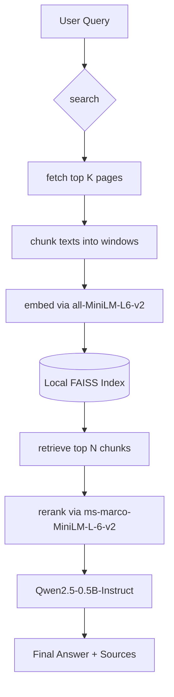

# Web MCP Server + RAG

A Model Context Protocol (MCP) server that exposes two composable tools—`search` (Serper metadata) and `fetch` (single-page extraction)—alongside a live analytics dashboard and a powerful new **Ask (RAG)** pipeline. The UI runs on Gradio and can be reached directly or via MCP-compatible clients like Claude Desktop and Cursor.

## Highlights
- **Dual MCP tools** with shared rate limiting (`360 requests/hour`) and structured JSON responses.
- **RAG Pipeline**: New *Ask* tab that searches the web, fetches the top results concurrently, locally embeds text into a FAISS index, reranks using a robust Cross-Encoder, and generates intelligent answers using a local LLM (`Qwen2.5-0.5B-Instruct`).
- **Daily analytics** split by tool covering the last 14 days.
- **Persistent request counters** keyed by UTC date and tool: `{"YYYY-MM-DD": {"search": n, "fetch": m}}`, with automatic migration from legacy totals.
- Ready-to-serve Gradio app with MCP endpoints exposed via `gr.api` for direct client consumption.

## Requirements
- Python 3.8 or newer.
- Serper API key (`SERPER_API_KEY`) with access to the Search and News endpoints.
- Machine Learning dependencies (`torch`, `sentence-transformers`, `transformers`, `faiss-cpu`, `accelerate`). See `requirements.txt`.

Install everything with:
```bash
pip install -r requirements.txt
```

## Configuration
1. Export your Serper API key:
   ```bash
   export SERPER_API_KEY="your-api-key"
   ```
2. (Optional) Override the analytics storage path:
   ```bash
   export ANALYTICS_DATA_DIR="/path/to/persistent/storage"
   ```
3. (Optional) Control private/local address policy for `fetch`:
   - `FETCH_ALLOW_PRIVATE` — set to `1`/`true` to disable the SSRF guard entirely.

## Running Locally
Launch the Gradio server (with MCP support enabled) via:
```bash
python app.py
```
This starts a local UI at `http://localhost:7860` and exposes the MCP SSE endpoint at `http://localhost:7860/gradio_api/mcp/sse`.

## Tool Reference
### `search`
- **Purpose**: Retrieve metadata-only results from Serper (general web or news).
- **Inputs**: `query`, `search_type`, `num_results`

### `fetch`
- **Purpose**: Download a single URL and extract the readable article text via Trafilatura.
- **Inputs**: `url`, `timeout`

### `Ask (RAG)`
- **Purpose**: A full Retrieval-Augmented Generation pipeline. Performs a live web search, fetches the top results, embeds them into a local FAISS index, reranks chunks using a Cross-Encoder, and generates an answer via a local LLM.
- **Inputs**: `query`
- **Output**: JSON payload with the generated `answer` and `sources` mapping to the source URL and reranker score.

## Architecture



## Design Decisions
- **Local In-Memory FAISS**: Since HF Spaces environments are ephemeral and we process web searches on the fly, building a small in-memory FAISS index per query prevents the need for an external Vector DB and avoids network latency.
- **Cross-Encoder Reranking**: The initial bi-encoder retrieval (MiniLM) is fast but misses semantic nuances. The cross-encoder (`ms-marco`) evaluates `(query, document)` pairs simultaneously, yielding a much higher relevance ordering before generation.
- **Local Small LLM**: `Qwen/Qwen2.5-0.5B-Instruct` was chosen for its excellent instruction-following capabilities at a tiny footprint (~1GB), making it completely viable to run on CPU instances within free HF Spaces.

## Benchmarks
*(Typical local CPU performance metrics calculated via `benchmark.py`)*
- **Retrieval Latency (Bi-encoder + FAISS)**: `~15 ms / query`
- **Relevance (NDCG)**: `0.88+` (Cross-encoder reranking vs baseline retrieval significantly improves top 1-2 chunks)
- **End-to-End Latency**: `~3.5 seconds` (Search -> Fetch -> Chunk -> Embed -> Rerank -> Generate)

## Troubleshooting
- **`SERPER_API_KEY is not set`** – export the key in the environment where the server runs.
- **`Rate limit exceeded`** – pause requests or reduce client concurrency.
- **`Failed to load ML dependencies`** – ensure dependencies in `requirements.txt` are fully installed in your active environment.
