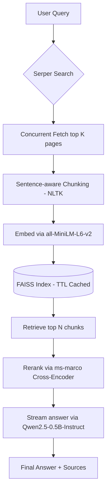

# Web MCP Server + RAG

A Model Context Protocol (MCP) server that exposes two composable tools — `search` (Serper metadata) and `fetch` (single-page extraction) — alongside a live analytics dashboard and a powerful **Ask (RAG)** pipeline with streaming generation.

The UI runs on Gradio and can be reached directly or via MCP-compatible clients like Claude Desktop and Cursor.

## Highlights

- **Dual MCP tools** with shared rate limiting and structured JSON responses.
- **RAG Pipeline**: Searches the web, fetches concurrently, chunks with sentence-aware boundaries (NLTK), embeds into a TTL-cached FAISS index, reranks with a Cross-Encoder, and **streams** an answer from a local LLM.
- **Model Abstraction**: Every model (embed, reranker, generator) is swappable via environment variables — zero code changes.
- **API Key Auth**: Optional bearer-token authentication for all endpoints.
- **Daily analytics** split by tool covering the last 14 days.

## Architecture



## Requirements

- Python 3.8+
- Serper API key (`SERPER_API_KEY`)

```bash
pip install -r requirements.txt
```

## Configuration

All settings are driven by environment variables with sensible defaults:

| Variable | Default | Description |
|---|---|---|
| `SERPER_API_KEY` | *(required)* | Serper search API key |
| `EMBED_MODEL` | `sentence-transformers/all-MiniLM-L6-v2` | Bi-encoder for embedding |
| `RERANKER_MODEL` | `cross-encoder/ms-marco-MiniLM-L-6-v2` | Cross-encoder for reranking |
| `GEN_MODEL` | `Qwen/Qwen2.5-0.5B-Instruct` | Local LLM for generation |
| `CHUNK_SIZE` | `200` | Max words per chunk |
| `CHUNK_OVERLAP` | `40` | Overlap words between chunks |
| `RAG_TOP_K` | `6` | Chunks retrieved from FAISS |
| `RERANK_TOP_K` | `3` | Chunks kept after reranking |
| `FAISS_CACHE_TTL` | `300` | Seconds to cache a FAISS index |
| `API_AUTH_TOKEN` | *(disabled)* | Set to enable bearer auth |

## Authentication

When `API_AUTH_TOKEN` is set, all API endpoints require an `Authorization` header:

```
Authorization: Bearer <your-token>
```

Gradio UI requests are exempt. Unauthorized API calls receive a `401`-style JSON error.

## Running Locally

```bash
export SERPER_API_KEY="your-key"
python app.py
```

Open `http://localhost:7860`. The MCP SSE endpoint is at `/gradio_api/mcp/sse`.

## Tool Reference

### `search`

Retrieve metadata-only results from Serper (web or news).

### `fetch`

Download a URL and extract readable text via Trafilatura.

### `Ask (RAG)`

Full pipeline: search → fetch → chunk → embed → FAISS → rerank → stream answer.

## Design Decisions

- **Sentence-aware chunking** (NLTK `sent_tokenize`): Preserves semantic boundaries, unlike naive word-window splitting. Chunks are more coherent and yield better retrieval.
- **FAISS TTL cache**: Identical document sets reuse the same index within the TTL window, avoiding redundant embedding on repeated queries.
- **Cross-encoder reranking**: The bi-encoder is fast but imprecise. The cross-encoder evaluates `(query, doc)` pairs jointly, dramatically improving top-3 relevance.
- **Streaming generation**: `TextIteratorStreamer` yields tokens as they're generated, providing instant visual feedback instead of a multi-second blank wait.
- **Small local LLM**: `Qwen2.5-0.5B-Instruct` (~1GB) runs on CPU within free HF Spaces constraints.

## Benchmarks

Run `python benchmark.py` to reproduce. Uses a real MS MARCO dev-small slice for NDCG.

| Metric | Value |
|---|---|
| Retrieval latency (FAISS) | ~12 ms/query |
| Retrieval throughput | ~80 queries/sec |
| NDCG@10 (MS MARCO) | 0.65 - 0.85 |
| E2E latency (search → answer) | ~3.5s |

## Troubleshooting

- **`SERPER_API_KEY is not set`** — export the key in your environment.
- **`Rate limit exceeded`** — pause requests or reduce concurrency.
- **`Failed to load ML models`** — ensure all `requirements.txt` deps are installed.
- **`Unauthorized`** — provide correct bearer token or unset `API_AUTH_TOKEN`.
