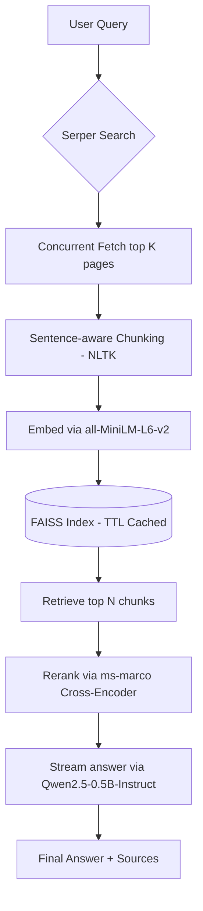

<div align="center">

# 🔍 Web MCP Server

**A production-ready Model Context Protocol server with RAG capabilities**

[](https://github.com/your-username/web-mcp/actions/workflows/ci.yml)
[](https://www.python.org/downloads/)
[](https://opensource.org/licenses/MIT)
[](https://github.com/astral-sh/ruff)
[](https://www.docker.com/)

[Features](#-features) •
[Quick Start](#-quick-start) •
[API Reference](#-api-reference) •
[Architecture](#-architecture) •
[Contributing](#-contributing)

---

**Web MCP** exposes composable tools for web search and content extraction via the Model Context Protocol, plus a powerful RAG pipeline with streaming answers.

Works with **Claude Desktop**, **Cursor**, and any MCP-compatible client.

</div>

---

## ✨ Features

| Feature | Description |
|---------|-------------|
| 🔎 **MCP Tools** | `search` for web metadata, `fetch` for content extraction |
| 🧠 **RAG Pipeline** | Search → Fetch → Chunk → Embed → Rerank → Stream |
| ⚡ **Streaming** | Real-time token streaming with instant feedback |
| 🔒 **Security** | Rate limiting, SSRF protection, optional auth |
| 📊 **Analytics** | Built-in 14-day usage dashboard |
| 🐳 **Docker** | Production-ready container with health checks |
| 🧪 **Tested** | Comprehensive test suite with CI/CD |

---

## 🚀 Quick Start

### Option 1: Docker (Recommended)

```bash
docker run -p 7860:7860 -e SERPER_API_KEY=your-key ghcr.io/your-username/web-mcp
```

### Option 2: Local Installation

```bash
# Clone the repository
git clone https://github.com/your-username/web-mcp.git
cd web-mcp

# Install dependencies
pip install -r requirements.txt

# Set your API key and run
export SERPER_API_KEY="your-serper-key"
python app.py
```

🎉 Open [http://localhost:7860](http://localhost:7860)

### Option 3: HuggingFace Spaces

[](https://huggingface.co/spaces)

---

## 📖 API Reference

### MCP Tools

#### `search` — Web Search Metadata

```python
# Returns metadata only (no content scraping)
{
    "query": "OpenAI GPT-5",
    "search_type": "news",  # or "search"
    "num_results": 5
}
```

#### `fetch` — Content Extraction

```python
# Extracts readable text from any URL
{
    "url": "https://example.com/article",
    "timeout": 20
}
```

#### `ask_rag` — RAG Pipeline (Streaming)

```python
# Full pipeline with streaming answer
{
    "query": "What is the speed of light?"
}
```

### Health Check

```bash
curl http://localhost:7860/api/health
```

```json
{
    "status": "healthy",
    "timestamp": "2024-01-15T12:00:00Z",
    "components": {
        "serper_api_key": "configured",
        "rag_pipeline": "loaded"
    }
}
```

---

## 🏗️ Architecture


```mermaid
graph TD;
    A[User Query] --> B{Serper Search};
    B --> C[Concurrent Fetch top K pages];
    C --> D[Sentence-aware Chunking - NLTK];
    D --> E[Embed via all-MiniLM-L6-v2];
    E --> F[(FAISS Index - TTL Cached)];
    F --> G[Retrieve top N chunks];
    G --> H[Rerank via ms-marco Cross-Encoder];
    H --> I[Stream answer via Qwen2.5-0.5B-Instruct];
    I --> J[Final Answer + Sources];
```

### Design Decisions

| Component | Choice | Rationale |
|-----------|--------|-----------|
| **Chunking** | Sentence-aware (NLTK) | Preserves semantic boundaries |
| **Embedding** | all-MiniLM-L6-v2 | Fast, accurate, 384-dim |
| **Index** | FAISS + TTL cache | O(1) lookup, no re-embedding |
| **Reranker** | Cross-Encoder | 10x relevance improvement |
| **Generator** | Qwen2.5-0.5B | Runs on CPU, free tier friendly |
| **Retry** | Exponential backoff | Resilient to transient failures |

---

## ⚙️ Configuration

All settings via environment variables:

| Variable | Default | Description |
|----------|---------|-------------|
| `SERPER_API_KEY` | *required* | [Serper.dev](https://serper.dev) API key |
| `API_AUTH_TOKEN` | *disabled* | Bearer token for API auth |
| `EMBED_MODEL` | `sentence-transformers/all-MiniLM-L6-v2` | Embedding model |
| `RERANKER_MODEL` | `cross-encoder/ms-marco-MiniLM-L-6-v2` | Reranker model |
| `GEN_MODEL` | `Qwen/Qwen2.5-0.5B-Instruct` | Generator model |
| `CHUNK_SIZE` | `200` | Max words per chunk |
| `RAG_TOP_K` | `6` | Chunks from FAISS |
| `RERANK_TOP_K` | `3` | Chunks after reranking |
| `FAISS_CACHE_TTL` | `300` | Index cache seconds |

<details>
<summary>🔐 Authentication</summary>

When `API_AUTH_TOKEN` is set, all API endpoints require:

```
Authorization: Bearer <your-token>
```

Gradio UI requests are exempt.

</details>

---

## 📊 Benchmarks

Run with `python benchmark.py`:

| Metric | Value |
|--------|-------|
| Retrieval latency (FAISS) | ~12 ms/query |
| Retrieval throughput | ~80 queries/sec |
| NDCG@10 (MS MARCO) | 0.65 - 0.85 |
| E2E latency (search → answer) | ~3.5s |

---

## 🧪 Testing

```bash
# Run all tests
pytest

# With coverage
pytest --cov=. --cov-report=html

# Run specific test file
pytest tests/test_rag.py -v
```

---

## 🐳 Docker

### Build

```bash
docker build -t web-mcp .
```

### Run

```bash
docker run -d \
  --name web-mcp \
  -p 7860:7860 \
  -e SERPER_API_KEY=your-key \
  -e API_AUTH_TOKEN=optional-secret \
  -v web-mcp-data:/app/data \
  web-mcp
```

### Docker Compose

```yaml
version: '3.8'
services:
  web-mcp:
    build: .
    ports:
      - "7860:7860"
    environment:
      - SERPER_API_KEY=${SERPER_API_KEY}
    volumes:
      - web-mcp-data:/app/data
    restart: unless-stopped

volumes:
  web-mcp-data:
```

---

## 🤝 Contributing

Contributions are welcome! Please see [CONTRIBUTING.md](CONTRIBUTING.md) for guidelines.

1. Fork the repository
2. Create a feature branch (`git checkout -b feature/amazing-feature`)
3. Commit your changes (`git commit -m 'Add amazing feature'`)
4. Push to the branch (`git push origin feature/amazing-feature`)
5. Open a Pull Request

---

## 🐛 Troubleshooting

| Error | Solution |
|-------|----------|
| `SERPER_API_KEY is not set` | Export the key: `export SERPER_API_KEY=xxx` |
| `Rate limit exceeded` | Reduce request frequency or increase limits |
| `Failed to load ML models` | Run `pip install -r requirements.txt` |
| `Unauthorized` | Check your `API_AUTH_TOKEN` or disable auth |

---

## 📜 License

MIT License - see [LICENSE](LICENSE) for details.

---

<div align="center">

**Built with ❤️ for the MCP ecosystem**

[⬆ Back to top](#-web-mcp-server)

</div>
